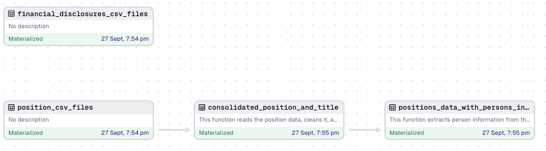

# Python wrappers to Scrape and Analyze CourtListener Data with Dagster Integration 
The goal of this project is to extend existing wrappers I have written to extract and transform data from [CourtListener's website](https://www.courtlistener.com/) and add Dagster's flexibility to the ETL process. Currently, through this project, a user can fetch data for the following APIs:
- people and positions: this returns details on all the people in CourtListener's database, and various positions held by them
- financial disclosures: According to the [Ethics in Government Act of 1978](https://www.govinfo.gov/content/pkg/USCODE-2010-title5/pdf/USCODE-2010-title5-app-ethicsing.pdf), judges are required to disclose their financial investments, gifts, reimbursements and additional consulting engagements that may conflict with their feduciary duties 


# Getting Started 
To get started on this project, after cloning the repo, you should set up a conda environment like so:
```
conda create -n "dagster-cl-aws" python=3.11.8
conda activate dagster-cl-aws
pip install dagster 
```
You will notice `setup.py` has names of a number of packages. Install these using
```
pip install -e ".[dev]"
```

Once this is done, you should be able to view the Dagster UI using the line
```
dagster dev
```
### Implementation Gotchas
Before running `dagster dev`, the user should make sure to check environment variables:
* The variables in `.env` file are assigned valid values. Since this project comes in with built-in S3 integration, Dagster will not run the code unless valid AWS access keys and a bucket name are provided.

# Folder Structure 
In this implementation, I tried to keep the integration straightforward with a goal of demonstrating the use case without spending too much time on dagster-specific code refactoring. 
```
├── __init__.py
├── __pycache__
│   ├── __init__.cpython-311.pyc
│   └── definitions.cpython-311.pyc
├── assets
│   ├── __init__.py
│   ├── __pycache__
│   │   ├── __init__.cpython-311.pyc
│   │   ├── cl_extract.cpython-311.pyc
│   │   ├── cl_transform.cpython-311.pyc
│   │   └── constants.cpython-311.pyc
│   ├── cl_extract.py
│   ├── cl_transform.py
│   └── constants.py
├── data
│   ├── financial-disclosures
│   │   ├── financial-disclosures_pages_11_to_15.csv
│   │   ├── financial-disclosures_pages_16_to_20.csv
│   │   ├── financial-disclosures_pages_1_to_5.csv
│   │   ├── financial-disclosures_pages_21_to_25.csv
│   │   ├── financial-disclosures_pages_26_to_30.csv
│   │   ├── financial-disclosures_pages_31_to_35.csv
│   │   ├── financial-disclosures_pages_36_to_40.csv
│   │   ├── financial-disclosures_pages_41_to_45.csv
│   │   ├── financial-disclosures_pages_46_to_50.csv
│   │   └── financial-disclosures_pages_6_to_10.csv
│   ├── intermediate_dfs
│   │   ├── cleaned_positions.csv
│   │   ├── consolidated_positions.csv
│   │   └── positions_with_person_info.csv
│   └── positions
│       ├── positions_pages_101_to_105.csv
│       ├── positions_pages_106_to_110.csv
│       ├── positions_pages_111_to_115.csv
│       ├── positions_pages_116_to_120.csv
│       ├── positions_pages_11_to_15.csv
│       ├── positions_pages_121_to_125.csv
│       ├── positions_pages_16_to_20.csv
│       ├── positions_pages_1_to_5.csv
│       ├── positions_pages_21_to_25.csv
│       ├── positions_pages_26_to_30.csv
│       ├── positions_pages_31_to_35.csv
│       ├── positions_pages_36_to_40.csv
│       ├── positions_pages_41_to_45.csv
│       ├── positions_pages_46_to_50.csv
│       ├── positions_pages_51_to_55.csv
│       ├── positions_pages_56_to_60.csv
│       ├── positions_pages_61_to_65.csv
│       ├── positions_pages_66_to_70.csv
│       ├── positions_pages_6_to_10.csv
│       ├── positions_pages_71_to_75.csv
│       ├── positions_pages_76_to_80.csv
│       ├── positions_pages_81_to_85.csv
│       ├── positions_pages_86_to_90.csv
│       ├── positions_pages_91_to_95.csv
│       └── positions_pages_96_to_100.csv
├── definitions.py
└── resources
    ├── __init__.py
    ├── __pycache__
    │   ├── __init__.cpython-311.pyc
    │   └── api_scraper.cpython-311.pyc
    └── api_scraper.py
```
The bulk of code in this repository lies in the file `api_scraper.py`. In this, I have defined a generic Scraper class and a CourtListener-specific CLScraper class, which are used in extracting positions and financial disclosure data in `assets > cl_extract.py`

# Code Refactoring
To demonstrate how the scraping part can be scaled while creating a good user experience, I incorporated the following functionalities in the code:
* **Logging:** APIScraper creates a logging file specific to the API endpoint and the mode of downloading data. For example, there will be a separate log file for `positions` and a separate one for `financial disclosures`. Further, if we want to iterate over judges and find specific data for them on CourtListener, we can create judge specific log files too.

* **Flexibility to scrape _n_ number of pages and continue from last URL:** The log files are setup such that they store the last URL that was scraped and the count of CourtListener pages scraped till now. To start from scratch, the user can simply delete this data from logs. This added functionality allows to scrape say only 5-10 pages for testing ETL workflows.

* **Flexible Storage:** While I haven't tested this comprehensively, this code allows the user to save scraping results as a csv on their local as well as to an S3 bucket they define in the `.env` file. 

# Materializing on Dagster
Successful implementation on Dagster looks like so:


# Next Steps
As our research work proceeds, I will continue to refactor old code to fit into Dagster's framework for building and testing ETL pipelines in a scalable fashion. 